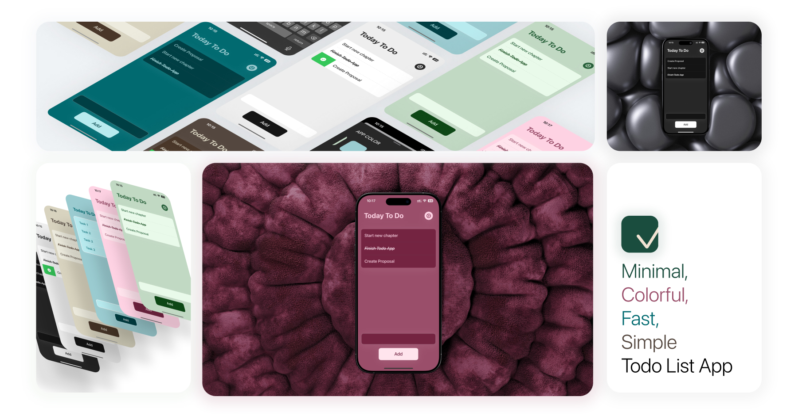

# TodayToDo App 📝📱

### Building a Minimal Task Manager with SwiftUI & SwiftData

This app is a personal project I’ve been working on as part of my learning journey with SwiftUI and SwiftData. It’s a simple yet powerful **To-Do List app**, designed to help users keep track of their daily tasks. An iOS To-Do app built with SwiftUI, featuring a colorful, user-friendly interface that supports both light and dark modes. It allows users to easily manage tasks, mark them as completed, and customize settings for a personalized experience. This project uses SwiftData for efficient data management and showcases my practice with SwiftUI’s powerful layout and design capabilities. Future updates may include app store release—stay tuned!

## 📌 Project Overview  
The **TodayToDo** app allows users to add, view, and delete tasks. It uses **SwiftUI** for the user interface and **SwiftData** for storing tasks locally. This project helped me dive deeper into managing data in Swift apps and exploring more advanced SwiftUI features.

⚠️ **Important:** All rights reserved. Unauthorized use or reproduction without attribution is prohibited and illegal.

## 🚀 What I Focused On  
- **SwiftUI:** Created a minimal and intuitive UI using **SwiftUI**.  
- **SwiftData:** Used **SwiftData** to manage the tasks efficiently.  
- **Task Management:** Allowed users to add, delete, and manage tasks.  
- **UX/UI:** Focused on user-friendly design with easy navigation.  

## 🔥 Features  
✅ Simple to-do list with add and delete tasks functionality  
✅ Tasks stored using **SwiftData** for persistence  
✅ Clean and modern SwiftUI interface  
✅ Minimal design, focusing on usability  

---

## 📸 Screenshot  
  

---

## 🛠️ How to Use  
1. Clone this repository.  
2. Open the project in Xcode (iOS 16+ recommended).  
3. Run the app on your device or simulator to start managing your tasks.

---

## 📬 Contact  
If you have any questions or suggestions, feel free to reach out:  
- **Email**: [aranfononi@gmail.com](mailto:aranfononi@gmail.com)  
- **LinkedIn**: [Aran Fononi](https://www.linkedin.com/in/aran-fononi-18182b265)
